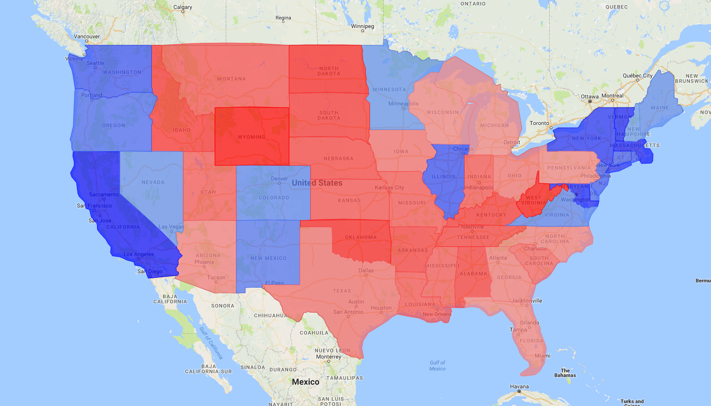

=================
us_polygon_mapper
=================

us_polygon_mapper allows users to create polygon maps of the United States from csv’s, python dictionaries and pandas DataFrames. The script utilizes Google Maps API (gmplot wrapper). You can create html files and png’s (when a png is created, an html is also created). PhantomJS must be installed to create png’s (see below).

Basics
======
To install:
::

    pip install us_polygon_mapper

To use:
::

    #!/usr/bin/env python
    
    import us_polygon_mapper.us_polygon_mapper as uspm

You can use any of the following as data inputs:

1. A csv with a column containing states (full or abbreviated) and another column containing values
2. A dictionary of the form {state1: value1, state2: value2}
3. A pandas DataFrame with a column containing states (full or abbreviated) and another column containing values

The map works by splitting your data into two groups. The “low” group will contain all data points <= the “middle” (by default, the mean). The “high” group will contain all the data points > the “middle”.

A color is specified for the “low” group and the “high” group (by default: green and red respectively).

Colors: ‘red’, ‘orange’, ‘yellow’, ‘green’, ‘blue’, ‘purple’, ‘brown’

Middle: ‘mean’, ‘median’, float, ‘percentile=x’ (x: 0-100)

By default, for csv’s and pandas DataFrames, the states column is assumed to be column 0, and the values column is assumed to be column 1.

You can change this by passing the argument columns=[state_column_num, value_column_num] (e.g. [2, 3]) or columns=[state_column_name, value_column_name] (e.g. [‘state’, ‘debt’]) or a combination (e.g. [‘state’, 7]).

Use case:
=========

For example, you could use this package to create a map of election results. You could make your values GOP% - DEM% for each state. You would then set your “middle” to be 0, “low color” to be blue and “high color” to be red. See example.py.

Main Functions
==============

The main functions are:

* uspm.dict_to_html(values_dict, low_color=“green”, high_color=“red”, middle=“mean”, html_fn=“mymap.html”)

* uspm.csv_to_html(csv_path, low_color=“green”, high_color=“red”, middle=“mean”, columns=None, html_fn=“mymap.html”)

* uspm.df_to_html(df, low_color=“green”, high_color=“red”, middle=“mean”, columns=None, html_fn=“mymap.html”)

* uspm.dict_to_png(values_dict, low_color=“green”, high_color=“red”, middle=“mean”, png_fn=“mymap.png”, html_fn=“mymap.html”)

* uspm.csv_to_png(csv_path, low_color=“green”, high_color=“red”, middle=“mean”, columns=None, png_fn=“mymap.png”, html_fn=“mymap.html”)

* uspm.df_to_png(df, low_color=“green”, high_color=“red”, middle=“mean”, columns=None, png_fn=“mymap.png”, html_fn=“mymap.html”)

colors: ‘red’, ‘orange’, ‘yellow’, ‘green’, ‘blue’, ‘purple’, ‘brown’

middle: ‘mean’, ‘median’, float, ‘percentile=x’ (x: 0-100)

columns: None, [state_column_num, value_column_num], [state_column_name, value_column_name] or a combination (e.g. [‘state’, 7])

Remark on png’s
===============

To create png’s, you must have PhantomJS installed <http://phantomjs.org/download.html>.

**Mac:**

(With Homebrew) Enter “brew install phantomjs” in Terminal

**Windows:**

Download PhantomJS <http://phantomjs.org/download.html> and place phantomjs.exe in your Path (full steps below for Windows 10).

1. Download PhantomJS <http://phantomjs.org/download.html>
2. Go to Control Panel > System and Security > System
3. Click "Advanced system settings" in the left panel
4. Click Environment Variables...
5. Either move phantomjs.exe to a folder in your Path, or add the folder phantomjs.exe is in to your Path.

Notes
=====

* state coordinates: <https://github.com/kjhsoftware/us-state-polygons/blob/master/states.xml>

* state abbreviations: <https://gist.github.com/rogerallen/1583593>

* 2016 election results: <http://cookpolitical.com/story/10174>